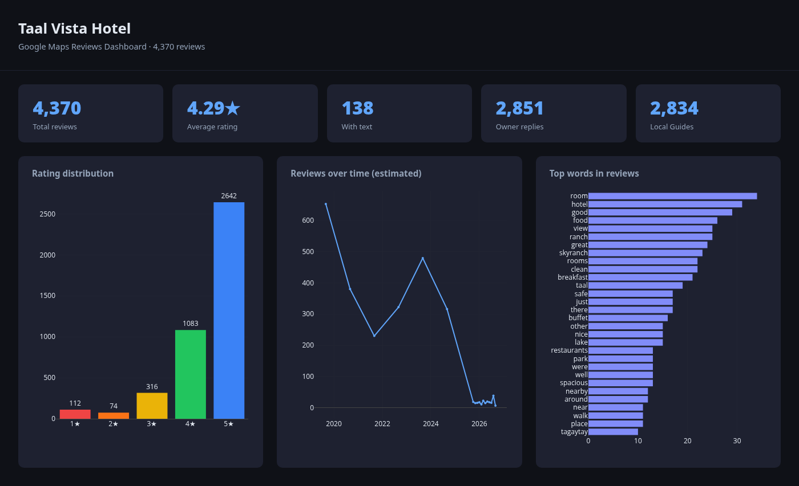

# google-maps-reviews-scraper

**Get all Google Maps reviews for any place — free, no API key, no limits.**

The Google Places API charges ~$17 per 1,000 reviews. This gets them all for $0.

> Scraped 4,370 reviews from a single hotel in under 10 minutes.



---

## Why this exists

If you want Google Maps reviews at scale, your options are:

- **Google Places API** — capped at 5 reviews per place, costs money beyond the free tier
- **Third-party APIs** (SerpApi, Outscraper, etc.) — pay per request, no control over your data
- **Existing scrapers** — most scroll the DOM and silently break after ~900 reviews because the scroll container hits a physical maximum height

This tool takes a different approach: it intercepts the same internal API that Google Maps itself uses, then paginates through all pages with cursor-based requests. No scroll limit. No DOM parsing. No vendor lock-in. Works as long as you have a Google account.

## How it's different

Most scrapers break after ~900 reviews because they rely on scrolling, which hits a physical DOM limit. This one intercepts the real `batchexecute` API that Google Maps uses internally and paginates via cursor — the same way the app does it. No scroll limit. No review cap.

| | This tool | Other scrapers | Google Places API |
|---|---|---|---|
| Review limit | ✅ None | ❌ ~900 | ❌ 5 per place |
| Cost | ✅ Free | ✅ Free | ❌ ~$17/1k reviews |
| API key required | ✅ No | ✅ No | ❌ Yes |
| Breaks on UI changes | ✅ No (API) | ❌ Yes (DOM) | ✅ No |
| Local Guide info | ✅ Yes | ❌ No | ❌ No |
| Estimated dates | ✅ Yes | ❌ No | ❌ No |
| HTML dashboard | ✅ Yes | ❌ No | ❌ No |

---

## Requirements

- Python ≥ 3.11
- Google Chrome installed
- A Google account logged in on Chrome (for session auth)

## Install

```bash
pip install uv
uv pip install -e .
playwright install chromium
```

## Usage

```bash
# Scrape all reviews — saves to SQLite
gmaps-reviews scrape "https://www.google.com/maps/place/..."

# Scrape + export CSV + generate dashboard
gmaps-reviews scrape "https://..." --csv reviews.csv --dashboard dashboard.html

# Export from existing DB without scraping again
gmaps-reviews export --csv out.csv --dashboard out.html
```

## Output fields

| Field | Description |
|---|---|
| `review_id` | Stable Google review ID |
| `author` | Reviewer name |
| `local_guide` | True / False |
| `review_count` | Reviewer's total reviews on Google |
| `rating` | 1–5 stars |
| `date_relative` | "a year ago", "3 months ago"… |
| `date_estimated` | YYYY-MM estimated from relative date |
| `has_photos` | True / False |
| `review_text` | Full review text (original language) |
| `owner_reply` | Owner response, if any |

## How it works

1. Opens your real Chrome profile — inherits your Google session
2. Navigates to the Maps URL and clicks the Reviews tab
3. Scrolls once to trigger the first `batchexecute` request — captures the URL, headers, and session token (`x-maps-bgkey`)
4. Loops via in-page XHR with cursor substitution — no scrolling, no DOM parsing, no limits
5. Stores raw batches + parsed reviews in SQLite; exports CSV and HTML dashboard on demand

## License

MIT
